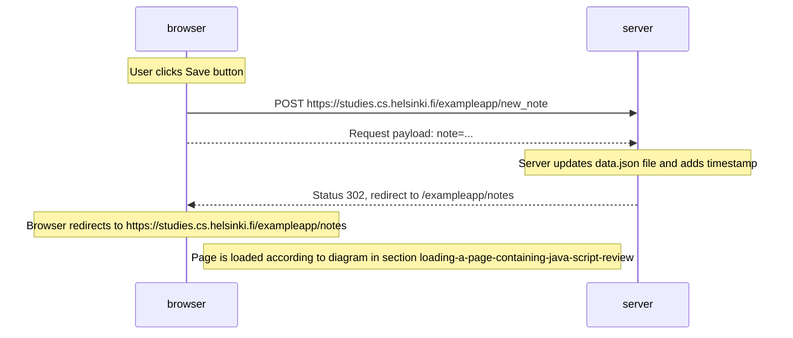

```mermaid
sequenceDiagram
participant b as browser
participant s as server
Note over b: User clicks Save button
b->>s: POST https://studies.cs.helsinki.fi/exampleapp/new_note
b-->>s: Request payload: note=...
Note over s: Server updates data.json file and adds timestamp
s-->>b: Status 302, redirect to /exampleapp/notes
Note over b: Browser redirects to https://studies.cs.helsinki.fi/exampleapp/notes
Note right of b: Page is loaded according to diagram in section loading-a-page-containing-java-script-review
```
