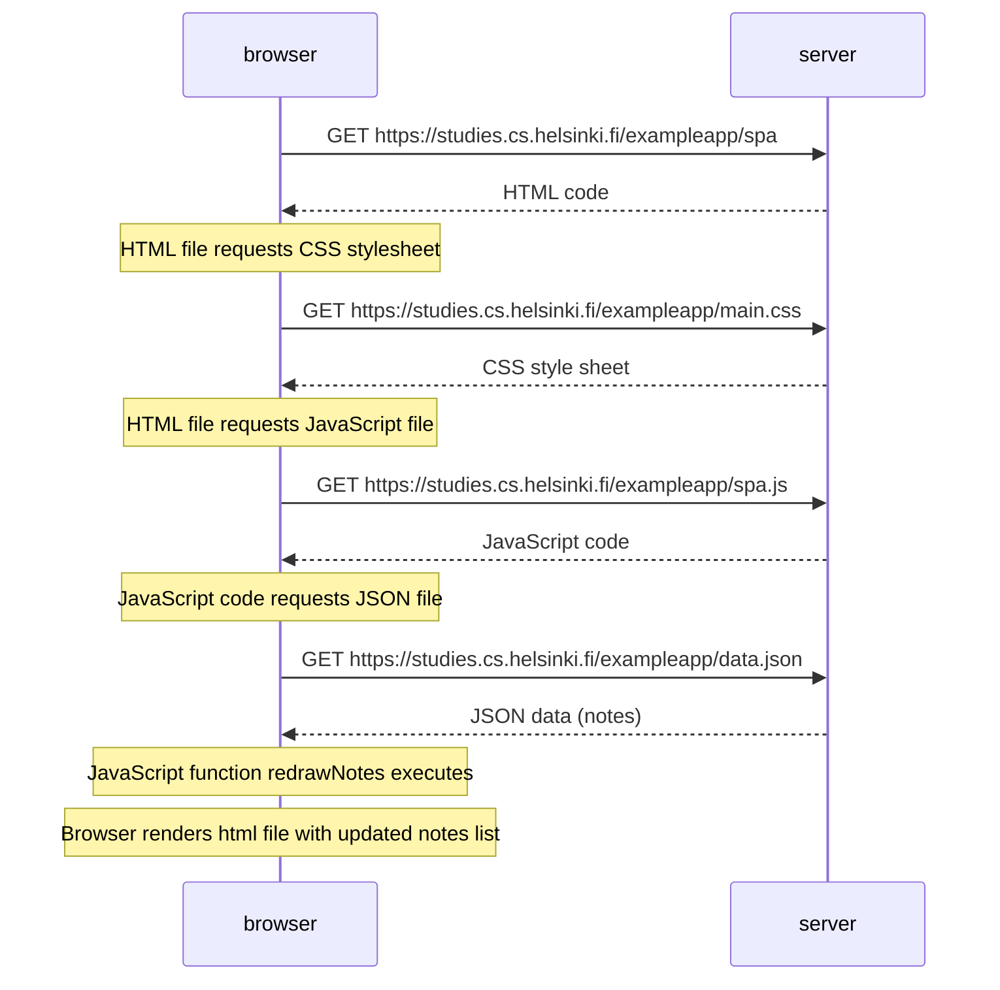

```mermaid
sequenceDiagram
participant b as browser
participant s as server
b->>s: GET https://studies.cs.helsinki.fi/exampleapp/spa
s-->>b: HTML code
Note over b: HTML file requests CSS stylesheet
b->>s: GET https://studies.cs.helsinki.fi/exampleapp/main.css
s-->>b: CSS style sheet
Note over b: HTML file requests JavaScript file
b->>s: GET https://studies.cs.helsinki.fi/exampleapp/spa.js
s-->>b: JavaScript code
Note over b: JavaScript code requests JSON file
b->>s: GET https://studies.cs.helsinki.fi/exampleapp/data.json
s-->>b: JSON data (notes)
Note over b: JavaScript function redrawNotes executes
Note over b: Browser renders html file with updated notes list
```
