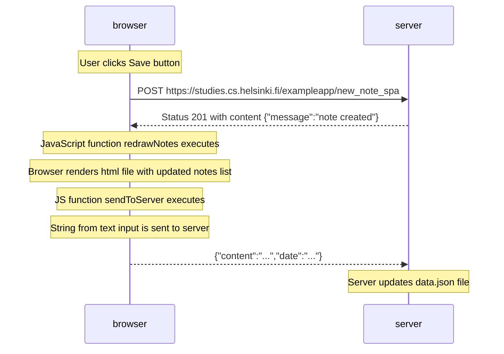

```mermaid
sequenceDiagram
participant b as browser
participant s as server
Note over b: User clicks Save button
b->>s: POST https://studies.cs.helsinki.fi/exampleapp/new_note_spa
s-->>b: Status 201 with content {"message":"note created"}
Note over b: JavaScript function redrawNotes executes
Note over b: Browser renders html file with updated notes list
Note over b: JS function sendToServer executes
Note over b: String from text input is sent to server
b-->>s: {"content":"...","date":"..."}
Note over s: Server updates data.json file
```
